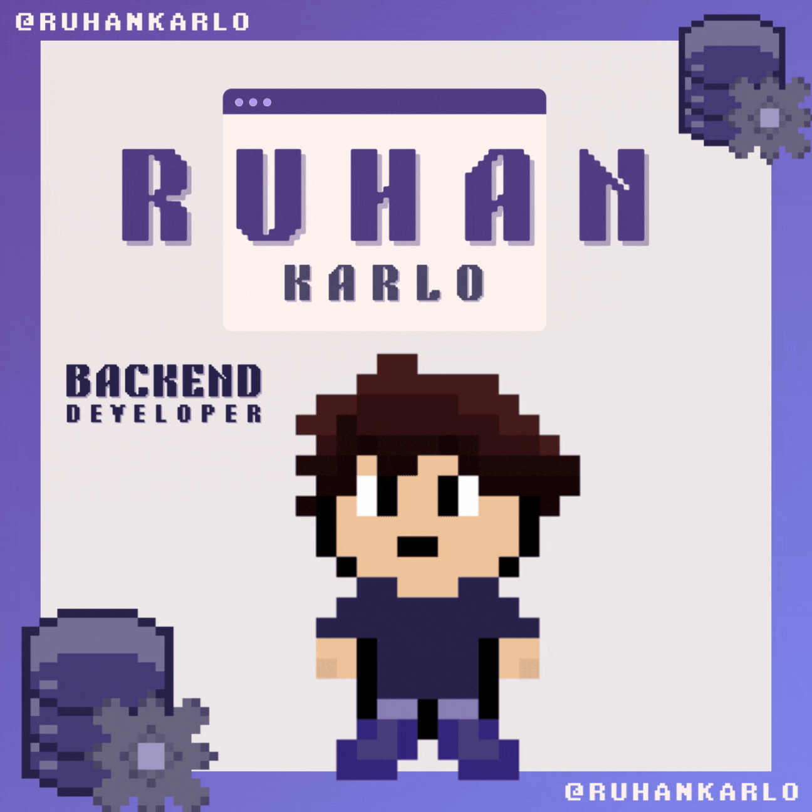

## OLÁ, MEU NOME É RUHAN KARLO
Portifólio:

 

**Uma breve apresentação:**

Atualmente trabalho como Analista de Suporte, venho me desenvolvendo na área voltada para o Desenvolvimento Backend e Devops.

**Sobre mim:**

- 💻 Sou estudante de Ciência da Computação;
- ☑️ Reconheço-me como um programador Back-end;
- 📫 Email: ruhankarlo@gmail.com

    

  <h3> 👾 &nbsp;Principais ferramentas</h3>
  

    
    
    

    
  

